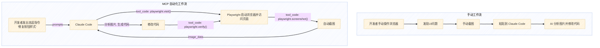

好的，我们来整理第四期吴恩达 Claude Code 教程的学习笔记。

基于您提供的详尽素材和结构要求，我将扮演一位科技媒体主编的角色，将这些一手资料和深度思考，重构成一篇结构清晰、论述严谨、兼具深度与可读性的专业文章。

***

> AI 编程的浪潮正从单纯的“代码生成”涌向更高级的“代理协作”。本期笔记将深入 Claude Code 的 Agentic 工作流，探讨如何通过计划、多模态交互及上下文工程，实现从前端 UI 优化到后端功能拓展的全链路开发。

### **核心洞见 (Key Insights)**

*   **代理心智 (Agentic Mindset)**：高效利用 AI 编程工具的关键，在于从“指令执行者”转变为“任务协作者”，采用“先计划、再执行、后验证”的闭环工作流。
*   **上下文工程 (Context Engineering)**：AI 的表现力极限取决于上下文的质量。精细化管理文件、对话历史与项目记忆，是释放其潜能的核心杠杆。
*   **多模态交互的演进**：从手动截图的“视觉提示”到 MCP 协议驱动的“程序化自动化测试”，我们正在见证人机协作在软件工程领域的范式迁移。
*   **思维预算 (Thinking Budget)**：通过特定指令引导 AI 进行更深度的思考，是解决复杂问题的有效策略，也是区别普通用户与高级玩家的分水岭。

---

## **Agentic 工作流：从“要 Z”到“基于 W 实现 Z”的跃迁**

在软件开发中，需求的复杂性往往超出单次“生成代码”所能覆盖的范畴。本期教程的核心，正是演示了 Claude Code 如何以一种“代理 (Agent)”的形态，处理端到端的复杂任务。这背后，是一套“先计划，再编码” (Plan First, Code Later) 的核心思想。

### **工作流的核心：计划模式 (Plan Mode)**

与直接发出指令让 AI 修改代码不同，计划模式（快捷键 `shift + tab` 两次）引入了一个关键的中间步骤：**思考与规划**。

该模式具备两大显著特征：
1.  **详尽思考**：AI 会投入更多的计算资源（即更高的“思维预算”）来分析需求、拆解任务、识别依赖、规划修改路径。
2.  **绝对安全**：它仅生成一份只读的修改建议，在获得用户明确授权（例如，点击“Accept”）之前，不会对任何文件进行实际修改。


这种工作流特别适用于**开启一个新功能、修复一个复杂 Bug 或进行代码重构**的场景。它将一个模糊的开发意图，转化为一份清晰、可审查、可执行的行动蓝图。

我们可以将开发者与 AI 协作的 Prompt 范式划分为四个层次，这清晰地体现了从简单执行到复杂协作的演进：

```mermaid
---
config:
  layout: dagre
  theme: base
  look: handDrawn
---
graph TD
    subgraph "Prompt 进化阶梯"
        direction LR
        L1["L1: 我要Z<br/>(直接指令)"]
        L2["L2: 现在是Y, 我要Z<br/>(提供现状)"]
        L3["L3: 我做了X, 现在是Y, 我要Z<br/>(补充背景)"]
        L4["L4: 请基于W, 实现Z<br/>(给出明确规划)"]
    end

    L1 --> L2 --> L3 --> L4

    subgraph "协作深度"
        direction LR
        d1["浅层"]
        d2[""]
        d3[""]
        d4["深度"]
    end
    
    L1 -- "更明确" --> L2
    L2 -- "更完整" --> L3
    L3 -- "更可控" --> L4

```

教程中，讲师 Elie 老师的多个 Prompt 都体现了 L2 甚至 L3 的水平，例如在第一个任务“实现引用链接”时，他明确给出了需要修改的文件，这就是典型的“提供了现状 Y”。而最高效的协作，则发生在计划模式中——我们让 AI 自行推导出详尽的计划 W，或者我们直接给出计划 W，从而实现 L4 级的协作。

```ad-tip {什么是 Agentic AI？}
Agentic AI，或称为 AI Agent (智能体)，指的是能够自主感知环境、制定计划、执行动作并根据反馈进行调整以达成特定目标的 AI 系统。与传统的“问答式”或“生成式”AI 不同，Agentic AI 强调**自主性 (Autonomy)** 和**目标导向 (Goal-driven)**。在编程领域，这意味着 AI 不再仅仅是一个代码片段生成器，而是一个能够理解整个项目上下文、执行多步任务、甚至与其他工具（如测试框架、API）交互的虚拟开发伙伴。
```

### **思维预算与深度思考指令集**

Claude Code 官方文档揭示了一个隐藏机制：可以通过 `think`, `think hard`, `think harder`, `ultrathink` 等关键词，显式地要求模型投入更多资源进行思考。这类似于 Google AI Studio 中的 `thinking budget` 可调选项，更高的预算通常意味着更周全、更优化的解决方案。


然而，在中英混合的输入环境下，这些英文关键词的效果可能不稳定。为了解决这个问题并提升效率，可以构建一套自定义的“深度思考”命令集。通过预设的 `slash command`（斜杠命令），将这些思考模式封装起来。

| Claude Code 思考模式 | 自定义斜杠命令 | 快捷方式 | 推荐应用场景 |
| :--- | :--- | :--- | :--- |
| Normal | - | - | 常规、简单的任务 |
| `think` | `/think` | `/t` | 添加新功能 (Add Feature) |
| `think hard` | `/think-hard` | `/tt` | 修复一般 Bug (Bug Fix) |
| `think harder` | `/think-harder` | `/ttt` | 修复复杂或关键 Bug |
| `ultrathink` | `/think-ultra` | `/tttt` | 大型重构 (Refactor) |

通过这种方式，一句简单的 `/tttt 重构用户认证模块` 就能精确地调用 Claude Code 的最高思考能力，极大地提升了处理复杂任务的成功率。已有开发者社区反馈，在未使用 `/think` 时无法解决的问题，在添加该指令后得到了成功解决。


## **上下文工程：为 AI 提供高质量的“记忆”**

AI 的表现力直接受限于其可感知的上下文质量。在 Claude Code 中，上下文管理主要体现在三个维度：文件上下文、对话上下文和项目上下文。

### **文件上下文 (`@`)：精准投喂**

通过 `@` 符号，我们可以将一个或多个文件/文件夹引入当前对话，为 AI 的分析和修改提供精准的靶向。这远比手动复制粘贴代码片段要高效和准确。

值得注意的是，Claude Code 在处理文件引用时采用了一种**按需读取 (On-demand Reading)** 的智能策略。它并非在引用时就将全部文件内容注入上下文，而是在后续的思考和执行过程中，当确实需要读取某个文件时，才通过工具调用来获取其内容。这有效节约了宝贵的上下文窗口，提升了处理效率。


在使用 `@` 引用时，有一些实践技巧需要注意：
*   **路径包含空格**：需要用引号将路径包裹起来，例如 `@"my project/file.js"`。
*   **路径包含特殊符号**：诸如 Next.js 路由组中的括号 `( )`，可能会干扰路径的自动补全。当路径中包含 `\` 时，括号等特殊字符可能会导致补全失败。
*   **最佳实践**：
    1.  直接输入不含特殊符号的文件名，在候选列表中选择。
    2.  如果候选列表过长，先在文件管理器中定位文件，复制其完整路径后粘贴。在 macOS 的 Finder 中，右键文件后按住 `Option` 键，菜单会从“拷贝”变为“拷贝路径名称”。
    3.  遵循上述规则处理包含空格的路径。


### **对话上下文 (`/clear` vs `/compact`)：遗忘还是提炼？**

随着对话的进行，上下文窗口会逐渐被填满。教程中，Elie 老师在切换任务时多次使用 `/clear` 命令清空上下文，这是一种推荐的做法，可以避免不同任务间的干扰。

然而，在某些场景下，我们希望 AI “记住”之前的某些关键结论或偏好。例如，当 Elie 老师告诉 AI “不要自动启动服务”后，因为使用了 `/clear`，在下一个任务中 AI 还是忘记了这一点。

此时，`/compact` 命令提供了更好的选择。它会压缩当前上下文，**丢弃不重要的细节，但保留关键的经验和总结**。这相当于为 AI 的短期记忆做了一次“精炼”，使其在开启新任务时能继承过往的“智慧”。

**Context Engineering (上下文工程)** 正是当前大模型应用领域的热点，如何巧妙地运用清理与压缩，直接影响着协作的流畅度和最终产出的质量。

### **项目上下文 (`CLAUDE.md`)：固化的团队共识**

对于那些需要在整个项目生命周期中都保持一致的规则或偏好，`CLAUDE.md` 文件提供了持久化的记忆。更有用的是，我们可以创建一个被 `.gitignore` 忽略的 `claude.local.md` 文件。

*   **`CLAUDE.md`**：用于存放团队共识，会被提交到 Git 仓库，对所有协作者生效。例如：“本项目遵循 RESTful API 风格”。
*   **`claude.local.md`**：用于存放个人偏好，不会被提交。例如教程中 Elie 老师的“我习惯自己手动启动服务，请不要运行 `./run.sh`”。

这种分层记忆机制，优雅地解决了团队协作中的共性与个性问题。

## **多模态交互：从截图到自动化测试的飞跃**

现代软件开发，尤其是前端开发，离不开视觉元素的参与。Claude Code 强大的多模态能力，将这种视觉沟通提升到了新的高度。

### **视觉提示：截图驱动的 UI 迭代**

教程中一个精彩的片段是，当 AI 生成的链接颜色（默认蓝色）在深色背景下难以辨认时，Elie 老师没有用文字去描述“请把链接颜色改得更亮”，而是直接截取了界面图片，并附言：“这些链接很难阅读，能让它在视觉上更吸引人吗？”


Claude Code 准确地理解了图片中的问题，并迅速给出了修改 CSS 的方案。这种“所见即所得”的沟通方式，极大降低了描述 UI 问题的沟通成本。

> **提示**：在 macOS 上，向 Claude Code 中粘贴图片的快捷键是 `Ctrl + V`，而非系统通用的 `Cmd + V`。

### **MCP 与 Playwright：程序化的“视觉”工作流**

如果说手动截图是多模态交互的 1.0 版本，那么 MCP (Model Context Protocol) 则将其带入了 2.0 时代——**自动化**。

```ad-tip {什么是 MCP (Model Context Protocol)？}
MCP 是一种协议，它允许像 Claude Code 这样的大语言模型与外部工具和服务进行标准化的、可发现的交互。通过 MCP，AI 不再局限于其内置能力，而是可以调用外部“插件”或“服务器”来获取信息、执行操作。这极大地扩展了 AI 的能力边界，使其能够与真实世界的系统（如文件系统、浏览器、数据库、API）进行深度集成。
```

教程中，通过引入 Playwright 的 MCP 服务器，Claude Code 获得了**直接控制浏览器的能力**。

```bash
claude mcp add playwright npx @playwright/mcp@latest

```

安装后，人机协作的流程发生了质变：



现在，开发者不再需要手动截图。当提出“请让‘新聊天’按钮的样式与其他链接保持一致，并移除边框”这样的高级指令后，Claude Code 会自动完成以下闭环：

1.  **启动浏览器**：调用 Playwright 访问指定的开发服务器 URL。
2.  **截取屏幕**：获取当前页面的视觉快照。
3.  **自我分析**：像人类一样“看”截图，识别出样式上的差异。
4.  **修改代码**：根据分析结果修改相关的前端代码。
5.  **再次截图验证**：刷新页面，再次截图，以确认修改是否生效且符合预期。

这个过程将原本需要开发者反复操作的“执行-验证”循环完全自动化，是 Agentic AI 在软件工程领域最具代表性的应用之一，极大地提升了开发与调试的效率。


## **全栈功能实现：后端工具的拓展**

除了前端交互，教程最后还演示了如何为后端添加新功能。任务是增加一个新工具，用于获取课程更详细的章节信息。

这个过程同样遵循了“先计划，再执行”的原则：
1.  **提出需求**：明确指出需要添加一个新工具，能够根据课程 ID 返回其所有 lesson 的编号、标题和描述。
2.  **生成计划**：Claude Code 分析了现有的 `search_tools.py` 文件，规划出需要执行的步骤：
    *   在 `search_tools.py` 中定义新的 `get_course_lessons` 函数和相应的 tool。
    *   更新系统提示 (System Prompt)，让模型知道这个新工具的存在及其用途。
    *   在 RAG 系统中注册这个新工具。
3.  **执行修改**：在用户批准计划后，自动对多个相关文件进行修改。


这个案例展示了 Claude Code 对后端逻辑、系统架构（如 RAG）和模型配置（如系统提示）的综合理解能力。通过提供清晰的上下文和遵循 Agentic 工作流，我们可以引导 AI 完成从数据接口到业务逻辑的深度拓展。

## **结语**

从本期教程中我们看到，以 Claude Code 为代表的 AI 编程助手，其价值早已超越了代码补全或函数生成。它正在成为一个真正的“开发代理”，深度参与到软件开发的整个生命周期中。掌握与这位“代理”协作的心法——精于规划、善用上下文、驾驭多模态交互——将是未来每一位开发者提升生产力的关键所在。我们不再仅仅是代码的编写者，更是与 AI 共同构建复杂系统的架构师与指挥家。