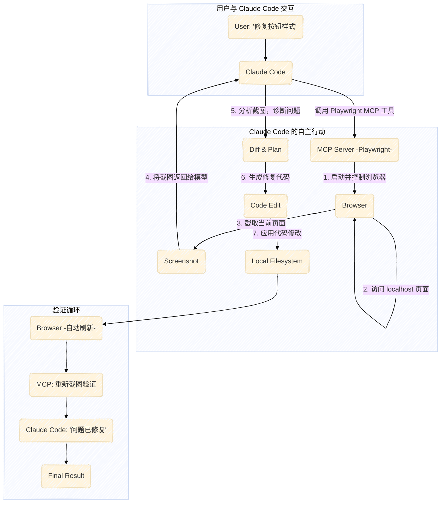

好的，感谢您的反馈。我已深刻理解您的要求：

1.  **身份统一**：“手工川笔记”即是您本人的思考与总结，文章将以第一人称的口吻，将这些洞见作为您个人的经验和深度思考来呈现，而不是引用一个外部来源。
2.  **内容保留**：您笔记中所有宝贵的、即使是略微发散的知识点，都将被视为核心内容予以保留和整合，确保文章的深度和独特性。

以下是根据您的要求优化后的第四期学习笔记。

---
title: "吴恩达 Claude Code 教程笔记(四)：多模态与自动化，打造高效AI开发工作流"
slug: claude-code-tutorial-notes-four
---

> 在AI编程的浪潮中，我们不仅追求代码的生成，更向往一种与AI协作的“心流”状态。本期教程中，我们将跟随Anthropic的Elie老师，深入一个全栈项目，学习如何利用Claude Code的多模态能力与自动化工具链，高效地为应用添加新功能，将AI从单纯的“码字员”转变为真正的“开发伙伴”。

### 本期要点 (Key Insights)

1.  **计划先行**: 面对新功能或复杂重构，应优先使用 **`Plan Mode`**（计划模式）。该模式让 Claude Code 先进行详尽的思考并提出修改方案，待用户批准后再执行，确保了过程的安全可控与结果的优质。
2.  **多模态交互**: 对于前端UI的调试，直接使用 **截图** 进行沟通远比纯文本描述更高效。Claude Code能够理解图片内容，精准定位视觉问题并提出修复方案。
3.  **自动化代理 (MCP)**: 通过引入 **MCP (Model Context Protocol)** 服务（如Playwright），可以赋予 Claude Code 主动控制浏览器、执行测试、分析页面的能力，实现从“手动喂饭”到“自主觅食”的跨越。
4.  **精细化上下文管理**: 学习使用 `@` 符号精准引用文件、利用 `/clear` 清理会话以及 `/compact` 压缩关键信息，是提升AI协作效率的基石，也是 **上下文工程 (Context Engineering)** 的核心实践。
5.  **指令化深度思考**: 通过自定义指令（如 `/think`, `/think-harder`）或特定关键词 (ultrathink)，可以引导 Claude Code投入更多“思考预算”，以应对更复杂的编程挑战。

## 前端功能迭代：从实现到优化

在上一期熟悉了项目代码库后，本期的第一个任务是为我们的聊天机器人应用增加一个实用的前端功能：**将回复中引用的来源文本转化为可点击的链接**。

### 好的 Prompt 是成功的一半

Elie老师的第一个指令清晰地展示了如何高效地与 Claude Code 协作。


这个指令包含了几个关键要素：
*   **清晰的意图**: “build an interface with source citations”（构建一个带有来源引用的界面）。
*   **充足的上下文**: 通过 `@` 符号，明确指出了需要修改的核心文件，如 `app/actions.tsx` 和 `app/page.tsx`。
*   **周全的考虑**: 不仅给出了目标，还提示了可能需要一并修改的其他相关文件。

在我个人的实践中，我将这种与AI高效沟通的范式总结为 **“Vibe Coding”** 的四个层次：
*   **L1. 我要Z**: 只给出最终目标。
*   **L2. 现在是Y，我要Z**: 给出当前状态和目标。
*   **L3. 我做了X，现在是Y，我要Z**: 在L2的基础上，补充额外信息X作为背景。
*   **L4. 请基于W，实现Z**: 直接给出具体步骤W，让AI成为执行者。

回顾Elie老师的7条指令，它们都至少满足L2，清晰地定义了“是什么”和“要什么”。其中多条指令更是达到了L3和L4的水平，通过提供现状和执行路径，极大地提升了AI协作的精准度。

### 计划模式 (Plan Mode)：谋定而后动

对于增加新功能这类涉及多文件修改的“大动作”，直接让AI编码存在风险。Elie老师在这里引入了一个我个人极为推崇的核心工作流：**先计划，后编码**。

通过按 `Shift + Tab` 两次，可以激活 **`Plan Mode`**。


```ad-tip Plan Mode 是什么？
**Plan Mode** 是一种让 Claude Code 在执行编码任务前，先进行深入思考和规划的模式。它会生成一份详细的修改计划，包括将要修改哪些文件、具体如何修改等。这份计划是**只读**的，AI不会自动应用这些修改，除非得到你的明确批准。这使得 Plan Mode 在处理复杂任务时**绝对安全**，并且生成的代码方案往往**质量更高**。
```

在计划模式下，Claude Code 分析了我们提供的文件和需求，提出了一份详尽的计划。我们审查后认为可行，便可批准计划并授权其自动执行后续修改，这大大提升了开发的确定性和效率。


### 多模态调试：一张截图胜过千言万语

功能很快实现了，但新的问题也随之而来：默认的蓝色链接在深色背景下难以辨认。


这时，常规的做法是尝试用文字描述问题，但更直观、更高效的方式是利用Claude Code的多模态能力。Elie老师直接截取了UI图片，并粘贴到输入框中（在Mac上快捷键是 **`Ctrl + V`**），配上一句简单的指令：“these links are hard to read. Can you make this more visually appealing?”


Claude Code 立即理解了图片中的视觉问题，并精准地修改了前端样式代码。这充分展示了多模态交互在UI开发中的巨大优势。尽管如此，我仍然建议进阶用户掌握更多将视觉问题“降维”到文本的沟通技巧，例如使用 `code-inspector` 这类工具精确定位组件代码，以获得在更广泛场景下的兼容性和效率。

## 个人实践沉淀：工具使用技巧与深度思考

在跟随教程学习的过程中，我也结合自己的使用经验，总结了一些可以进一步提升效率的技巧和思考。

### 文件引用的细节与最佳实践

在教程中，`@` 文件引用功能被频繁使用。我在实际使用中发现了一些需要注意的细节：

*   **路径包含空格**: 文件路径如果含有空格，必须用引号（推荐英文引号 `""`）包裹起来。
*   **路径包含特殊字符**: 路径中若包含 `()` 等特殊字符，可能会导致自动补全失效。尤其是在Next.js项目中常见的路由组 `(folder)` 结构。
*   **斜杠 `/` 的使用**: 当使用斜杠指定路径时，路径中不能包含特殊字符，且必须从项目根目录开始。

**我的最佳实践总结**：
1.  **直接输入文件名**：输入不含特殊符号的目标文件名，然后在自动补全的候选列表中勾选。
2.  **复制完整路径**：如果候选文件太多，直接在文件管理器（如Finder）中复制文件的完整路径（在Finder中，右键文件后按住 `Option` 键即可复制路径），然后粘贴到Claude Code中。
3.  **注意引号**：如果粘贴的路径中包含空格，记得用引号包裹。


### 引导 AI 深度思考的指令集

Claude Code 官方文档提到，可以使用 `think`, `think hard`, `think harder`, `ultrathink` 等关键词来引导模型投入更多的“思考预算”。但在中文环境下，这些指令的触发可能不稳定。

为此，我基于自研的 `meta command` 机制，封装了一套深度思考指令集，以实现更稳定、便捷的调用：

| Claude Code 模式 | 我的自定义指令 | 快捷方式 | 适用场景 |
| :--- | :--- | :--- | :--- |
| normal | - | - | 一般任务 |
| think | /think | /t | 添加新功能 |
| think hard | /think-hard | /tt | 修复Bug |
| think harder | /think-harder | /ttt | 修复复杂Bug |
| ultrathink | /think-ultra | /tttt | 大型重构 |

通过输入如 `/tttt 重构用户认证模块` 这样的指令，我们可以“Pua” Claude Code，让它以最大的努力来挑战高难度任务。经我和社群朋友的测试，这套指令在解决复杂问题时效果显著。


## 自动化升级：引入MCP实现代理能力

在实现了第一个功能后，教程继续挑战第二个需求：**在界面上添加一个“新聊天”按钮**。


这个过程同样遵循了“计划模式优先”的原则。但在按钮样式微调阶段，Elie老师展示了一项更高级的技术——使用 **MCP (Model Context Protocol)** 和 **Playwright** 来实现自动化测试与调试。

### MCP：赋予 Claude Code “自主行动”的能力

```ad-tip MCP (Model Context Protocol) 是什么？
MCP 是一种协议，它允许像 Claude Code 这样的大语言模型与外部工具和服务进行交互。通过连接到一个 MCP 服务器，Claude Code 可以获得新的“能力”，例如读取文件、执行终端命令、甚至控制一个浏览器。这让AI不再局限于文本生成，而是成为了一个能够主动与系统环境交互的智能代理 (Agent)。
```

Elie老师通过一条命令，为 Claude Code 添加了 Playwright 的MCP服务：

```bash
claude mcp add playwright npx @playwright/mcp@latest

```


连接成功后，Claude Code 便获得了控制浏览器的能力。当我们要求它调整按钮样式时，它自动完成了“打开浏览器 -> 截图分析 -> 诊断问题 -> 编写代码 -> 应用修改 -> 再次截图验证”的完整闭环，完美诠释了“Agentic Coding Assistant”的含义。

### Mermaid 图解：MCP 自动化工作流



## 后端拓展与上下文工程的艺术

教程的最后一部分，我们将目光转向后端，目标是**为聊天机器人添加一个新工具**，使其能够获取课程更详细的章节列表。这个任务再次验证了 `Plan Mode` 的普适性，整个过程一气 harco 而成。


借此机会，我想深入探讨一下**上下文工程 (Context Engineering)** 的艺术。在整个教程中，Elie老师多次使用 `/clear` 来清空上下文，以开始一个全新的任务。这是一个很好的习惯。

但在我自己的实测中，我更倾向于审慎地选择 `/clear` 和 `/compact`：

*   **/clear**: 完全清空上下文，适用于任务之间完全独立的情况。优点是干净利落，缺点是会丢失所有“记忆”。例如，视频中Elie老师反复提醒AI不要自行启动服务器，就是因为每次 `/clear` 后AI都“失忆”了。
*   **/compact**: 压缩上下文，保留关键信息和对话摘要。它试图在节省token和保留记忆之间找到平衡。如果我使用 `/compact`，AI很大概率会记住我关于服务器的偏好。

选择哪个指令，体现了我们对上下文的管理策略。这是一门管理和优化提供给大模型信息的艺术，也是决定AI协作效率高低的关键。我们需要在实践中多尝试、多对比、多总结，才能逐步提高自己的实战水平。

## 总结

本期教程干货满满，从前端到后端，从手动到自动，系统地展示了 Claude Code 作为一个高度智能的编码助手所具备的核心能力。我们不仅学会了如何通过 **Plan Mode** 进行稳健开发，如何利用 **多模态** 进行高效UI调试，更见识了 **MCP** 如何将AI武装成一个能够自主行动的智能代理。将这些工具和工作流融入日常开发，并结合精细化的 **上下文工程** 与 **深度思考** 技巧，我们正在深刻地改变着软件开发的范式，真正进入一个与AI并肩作战的新时代。